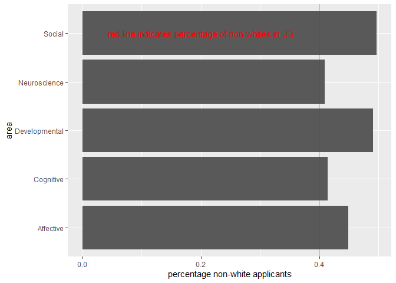

Admissions Analysis
================
Daniel O’Leary
4/17/2020

  - [Setup](#setup)
      - [Load Packages](#load-packages)
      - [Load Data](#load-data)
  - [Analysis](#analysis)
      - [Total number of apps by area](#total-number-of-apps-by-area)
      - [Version 1](#version-1)
      - [Version 2](#version-2)
      - [Ethnicity](#ethnicity)
          - [Count](#count)
          - [Percentage w/ version 1
            counts](#percentage-w-version-1-counts)
          - [Percentage w/ version 2
            counts](#percentage-w-version-2-counts)
          - [Percentage by year](#percentage-by-year)
      - [Gender](#gender)

# Setup

## Load Packages

## Load Data

``` r
eth <- 
  read_csv("C:/Users/Daniel/OneDrive - Leland Stanford Junior University/dc/applicant_analysis/applicant_analysis/results/eth_summaries.csv") 
```

    ## Parsed with column specification:
    ## cols(
    ##   X1 = col_character(),
    ##   Affective = col_double(),
    ##   Cognitive = col_double(),
    ##   Developmental = col_double(),
    ##   Neuroscience = col_double(),
    ##   Social = col_double(),
    ##   season = col_character()
    ## )

``` r
gender <- 
  read_csv("C:/Users/Daniel/OneDrive - Leland Stanford Junior University/dc/applicant_analysis/applicant_analysis/results/gender.csv") 
```

    ## Parsed with column specification:
    ## cols(
    ##   X1 = col_character(),
    ##   `2017-18` = col_double(),
    ##   `2018-19` = col_double(),
    ##   `2019-20` = col_double()
    ## )

``` r
n_applicants <- 
  read_csv("C:/Users/Daniel/OneDrive - Leland Stanford Junior University/dc/applicant_analysis/applicant_analysis/results/n_applicants.csv") 
```

    ## Parsed with column specification:
    ## cols(
    ##   X1 = col_character(),
    ##   `2017-18` = col_double(),
    ##   `2018-19` = col_double(),
    ##   `2019-20` = col_double()
    ## )

``` r
eth <-
  eth %>% 
  mutate(eth = X1) %>% 
  dplyr::select(-X1)

gender <-
  gender %>% 
  mutate(area = X1) %>% 
  dplyr::select(-X1)

n_applicants <-
  n_applicants %>% 
  mutate(area = X1) %>% 
  dplyr::select(-X1)
```

# Analysis

## Total number of apps by area

## Version 1

``` r
eth %>% 
  gather(area, value, Affective:Social) %>% 
  count(area, season, wt = value) %>% 
  mutate(
    total_apps = n
  ) %>% 
  dplyr::select(-c(n)) %>% 
  arrange(season)
```

    ## # A tibble: 15 x 3
    ##    area          season  total_apps
    ##    <chr>         <chr>        <dbl>
    ##  1 Affective     2017-18        138
    ##  2 Cognitive     2017-18         55
    ##  3 Developmental 2017-18        117
    ##  4 Neuroscience  2017-18         76
    ##  5 Social        2017-18        207
    ##  6 Affective     2018-19        160
    ##  7 Cognitive     2018-19         43
    ##  8 Developmental 2018-19        161
    ##  9 Neuroscience  2018-19         52
    ## 10 Social        2018-19        242
    ## 11 Affective     2019-20        223
    ## 12 Cognitive     2019-20         71
    ## 13 Developmental 2019-20        225
    ## 14 Neuroscience  2019-20        104
    ## 15 Social        2019-20        267

## Version 2

``` r
n_applicants %>% 
  gather(season, total_apps, `2017-18`:`2019-20`)
```

    ## # A tibble: 15 x 3
    ##    area          season  total_apps
    ##    <chr>         <chr>        <dbl>
    ##  1 Affective     2017-18        170
    ##  2 Cognitive     2017-18         77
    ##  3 Developmental 2017-18        130
    ##  4 Neuroscience  2017-18        101
    ##  5 Social        2017-18        232
    ##  6 Affective     2018-19        176
    ##  7 Cognitive     2018-19         62
    ##  8 Developmental 2018-19        181
    ##  9 Neuroscience  2018-19         73
    ## 10 Social        2018-19        248
    ## 11 Affective     2019-20        319
    ## 12 Cognitive     2019-20        127
    ## 13 Developmental 2019-20        282
    ## 14 Neuroscience  2019-20        141
    ## 15 Social        2019-20        358

## Ethnicity

### Count

``` r
eth %>% 
  gather(key, value, Affective:Social) %>% 
  count(eth, key, wt = value) %>% 
  ggplot(aes(fct_reorder(eth, n), n)) +
  geom_col() +
  facet_grid(. ~ key) + 
  coord_flip() +
  labs(
    x = "ethnicity",
    y = "count"
  )
```

<!-- -->

### Percentage w/ version 1 counts

``` r
eth %>% 
  gather(key, value, Affective:Social) %>% 
  count(eth, key, wt = value) %>% 
  left_join(
    eth %>% 
      gather(key, value, Affective:Social) %>% 
      count(key, wt = value) %>% 
      mutate(total_apps = n) %>% 
      dplyr::select(-c(n)),
    by = "key"
  ) %>% 
  mutate(
    per = n/total_apps
  ) %>% 
  ggplot(aes(fct_reorder(eth, per), per)) +
  geom_col() +
  scale_y_continuous(
    breaks = seq(0, 1, 0.2)
  ) +  
  facet_grid(. ~ key) + 
  coord_flip()  +
  labs(
    x = "ethnicity",
    y = "percentage"
  )
```

<!-- -->

``` r
eth %>% 
  gather(key, value, Affective:Social) %>% 
  count(eth, key, wt = value) %>% 
  left_join(
    eth %>% 
      gather(key, value, Affective:Social) %>% 
      count(key, wt = value) %>% 
      mutate(total_apps = n) %>% 
      dplyr::select(-c(n)),
    by = "key"
  ) %>% 
  mutate(
    per = n/total_apps
  ) %>% 
  filter(eth != "White") %>% 
  ggplot(aes(fct_reorder(eth, per), per)) +
  geom_col() +
  scale_y_continuous(
    breaks = seq(0, 1, 0.05)
  ) +
  facet_grid(. ~ key) + 
  coord_flip()  +
  labs(
    x = "ethnicity",
    y = "percentage"
  )
```

<!-- -->

### Percentage w/ version 2 counts

``` r
eth %>% 
  gather(key, value, Affective:Social) %>% 
  count(eth, key, wt = value) %>% 
  left_join(
    n_applicants %>% 
      gather(season, total_apps, `2017-18`:`2019-20`) %>% 
      count(area, wt = total_apps) %>% 
      mutate(
        key = area,
        total_apps = n
      ) %>% 
      dplyr::select(-c(n)),
    by = "key"
  ) %>% 
  mutate(
    per = n/total_apps
  ) %>% 
  ggplot(aes(fct_reorder(eth, per), per)) +
  geom_col() +
  scale_y_continuous(
    breaks = seq(0, 1, 0.2)
  ) +  
  facet_grid(. ~ key) + 
  coord_flip()  +
  labs(
    x = "ethnicity",
    y = "percentage"
  )
```

<!-- -->

``` r
eth %>% 
  gather(key, value, Affective:Social) %>% 
  count(eth, key, wt = value) %>% 
   left_join(
    n_applicants %>% 
      gather(season, total_apps, `2017-18`:`2019-20`) %>% 
      count(area, wt = total_apps) %>% 
      mutate(
        key = area,
        total_apps = n
      ) %>% 
      dplyr::select(-c(n)),
    by = "key"
  ) %>% 
  mutate(
    per = n/total_apps
  ) %>% 
  filter(eth != "White") %>% 
  ggplot(aes(fct_reorder(eth, per), per)) +
  geom_col() +
  scale_y_continuous(
    breaks = seq(0, 1, 0.05)
  ) +
  facet_grid(. ~ key) + 
  coord_flip()  +
  labs(
    x = "ethnicity",
    y = "percentage"
  )
```

<!-- -->

### Percentage by year

``` r
eth %>% 
  gather(key, value, Affective:Social) %>% 
  count(eth, season, key, wt = value) %>% 
  left_join(
    eth %>% 
      gather(key, value, Affective:Social) %>% 
      count(key, season, wt = value) %>% 
      mutate(total_apps = n) %>% 
      dplyr::select(-c(n)),
    by = c("key", "season")
  ) %>% 
  mutate(
    per = n/total_apps
  ) %>% 
  ggplot(aes(fct_reorder(eth, per), per)) +
  geom_col() +
  facet_grid(season ~ key) + 
  coord_flip()  +
  labs(
    x = "ethnicity",
    y = "percentage"
  )
```

<!-- -->

``` r
eth %>% 
  gather(key, value, Affective:Social) %>% 
  count(eth, season, key, wt = value) %>% 
  left_join(
    eth %>% 
      gather(key, value, Affective:Social) %>% 
      count(key, season, wt = value) %>% 
      mutate(total_apps = n) %>% 
      dplyr::select(-c(n)),
    by = c("key", "season")
  ) %>% 
  mutate(
    per = n/total_apps
  ) %>% 
  filter(eth != "White") %>% 
  ggplot(aes(fct_reorder(eth, per), per)) +
  geom_col() +
  facet_grid(season ~ key) + 
  coord_flip()  +
  labs(
    x = "ethnicity",
    y = "percentage"
  )
```

<!-- -->

## Gender

``` r
gender %>% 
  gather(key, value, `2017-18`:`2019-20`) %>% 
  group_by(area) %>% 
  summarise(
    per = mean(value, na.rm = TRUE)
  ) %>% 
  ggplot(aes(fct_reorder(area, per), per)) +
  geom_col() + 
  coord_flip() +
  labs(
    x = "area",
    y = "percent female"
  )
```

<!-- -->

``` r
gender %>% 
  gather(key, value, `2017-18`:`2019-20`) %>% 
  ggplot(aes(fct_reorder(area, value), value)) +
  geom_col() + 
  facet_grid(. ~ key) +
  coord_flip()  +
  labs(
    x = "area",
    y = "percent female"
  )
```

<!-- -->
